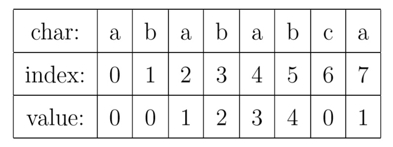
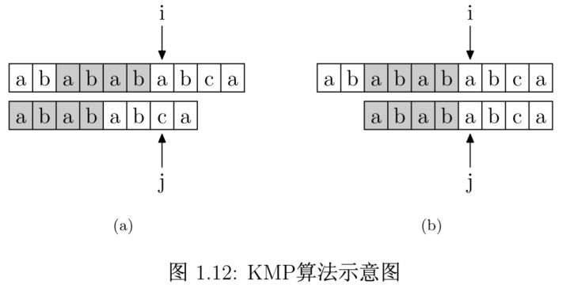
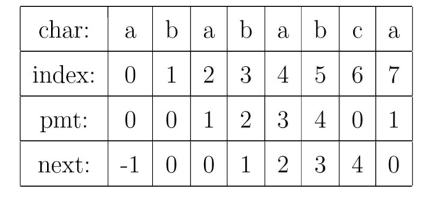
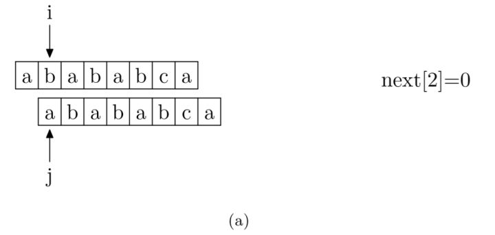
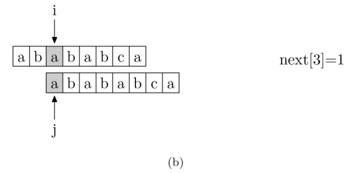
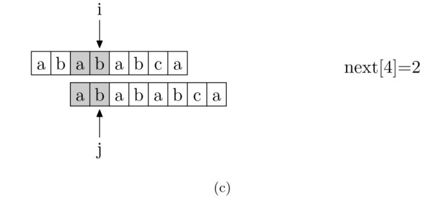
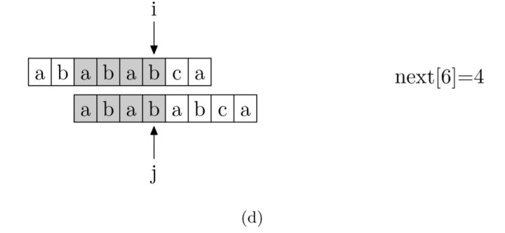
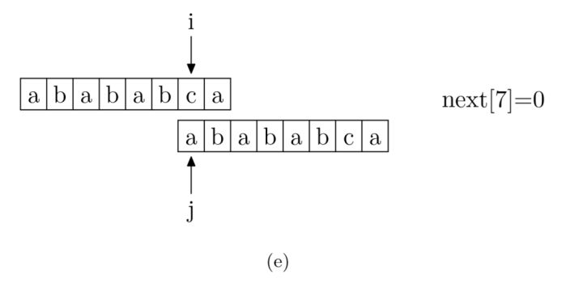

作者：[海纳](https://www.zhihu.com/people/hinus)

链接：https://www.zhihu.com/question/21923021/answer/281346746

有些算法，适合从它产生的动机，如何设计与解决问题这样正向地去介绍。但 KMP 算法真的不适合这样去学。最好的办法是先搞清楚它所用的数据结构是什么，再搞清楚怎么用，最后为什么的问题就会有恍然大悟的感觉。我试着从这个思路再介绍一下。大家只需要记住一点，PMT 是什么东西。然后自己临时推这个算法也是能推出来的，完全不需要死记硬背。

---
KMP 算法的核心，是一个被称为部分匹配表 (Partial Match Table) 的数组。我觉得理解 KMP 的最大障碍就是很多人在看了很多关于 KMP 的文章之后，仍然搞不懂 PMT 中的值代表了什么意思。这里我们抛开所有的枝枝蔓蔓，先来解释一下这个数据到底是什么。对于字符串 “abababca"，它的 PMT 如下表所示：



就像例子中所示的，如果待匹配的模式字符串有 8 个字符，那么 PMT 就会有 8 个值。

---
我先解释一下字符串的前缀和后缀。
- 如果字符串 A 和 B，存在 A=BS，其中 S 是任意的非空字符串，那就称 B 为 A 的前缀。例如，"Harry" 的前缀包括 {"H", "Ha", "Har", "Harr"}，我们把所有前缀组成的集合，称为字符串的前缀集合。
- 同样可以定义后缀 A=SB， 其中 S 是任意的非空字符串，那就称 B 为 A 的后缀，例如，“Potter" 的后缀包括 {"otter", "tter", "ter", "er", "r"}，然后把所有后缀组成的集合，称为字符串的后缀集合。要注意的是，字符串本身并不是自己的后缀。

---
有了这个定义，就可以说明 PMT 中的值的意义了。**PMT 中的值是字符串的前缀集合与后缀集合的交集中最长元素的长度。**

例如，对于 "aba"，它的前缀集合为 {"a", "ab"}，后缀集合为 {"ba", "a"}。两个集合的交集为 {"a"}，那么长度最长的元素就是字符串 "a" 了，长度为 1，所以对于 "aba" 而言，它在 PMT 表中对应的值就是 1。

再比如，对于字符串 "ababa"，它的前缀集合为 {"a", "ab", "aba", "abab"}，它的后缀集合为 {"baba", "aba", "ba", "a"}， 两个集合的交集为 {"a", "aba"}，其中最长的元素为 "aba"，长度为 3。

---
好了，解释清楚这个表是什么之后，我们再来看如何使用这个表来加速字符串的查找，以及这样用的道理是什么。

如图 1.12 所示，要在主字符串 "ababababca" 中查找模式字符串 "abababca"。如果在 j 处字符不匹配，那么由于前边所说的模式字符串 PMT 的性质，主字符串中 i 指针之前的 PMT[j −1] 位就一定与模式字符串的第 0 位至第 PMT[j−1]-1 位是相同的。

这是因为主字符串在 i 位失配，也就意味着主字符串从 i−j 到 i-1 这一段是与模式字符串的 0 到 j-1 这一段是完全相同的。而我们上面也解释了，模式字符串从 0 到 j−1，在这个例子中就是 "ababab"，其前缀集合与后缀集合的交集的最长元素为 "abab"， 长度为 4。

所以就可以断言，主字符串中 i 指针之前的 4 位一定与模式字符串的第 0 位至第 3 位是相同的，即长度为 4 的后缀与前缀相同。

这样一来，我们就可以将这些字符段的比较省略掉。具体的做法是，保持 i 指针不动，然后将 j 指针指向模式字符串的第 PMT[j −1]-1 位即可。



简言之，以图中的例子来说，在 i 处失配，那么主字符串和模式字符串的前边 6 位就是相同的。又因为模式字符串的前 6 位，它的前 4 位前缀和后 4 位后缀是相同的，所以我们推知主字符串 i 之前的 4 位和模式字符串开头的 4 位是相同的。就是图中的灰色部分。那这部分就不用再比较了。

---
有了上面的思路，我们就可以使用 PMT 加速字符串的查找了。我们看到如果是在 j 位失配，那么影响 j 指针回溯的位置的其实是第 j −1 位的 PMT 值，所以为了编程的方便， 我们不直接使用 PMT 数组，而是将 PMT 数组向后偏移一位。我们把新得到的这个数组称为 next 数组。

下面给出根据 next 数组进行字符串匹配加速的字符串匹配程序。其中要注意的一个技巧是，在把 PMT 进行向右偏移时，第 0 位的值，我们将其设成了-1，这只是为了编程的方便，并没有其他的意义。在本节的例子中，next 数组如下表所示。



具体的程序如下所示：
```c
int KMP(char * t, char * p) 
{
	int i = 0; 
	int j = 0;

	while (i < strlen(t) && j < (int)strlen(p))
	{
		if (j == -1 || t[i] == p[j]) 
		{
			i++;
			j++;
		}
		else 
			j = next[j];
	}

	if (j == strlen(p))
		return i - j;
	else 
		return -1;
}
```

> 第二处是 KMP 算法中 while (i < strlen(t) && j < strlen(p))，其中的 strlen() 函数的返回值类型是 unsigned int，而 j 的类型是 int，两者比较过程中，int 类型会转化为 unsigned int 类型，所以当 j 的值为-1 时，会有 j > strlen(p)，意外跳出循环，应改为 while (i < strlen(t) && j < (int)strlen(p))。

好了，讲到这里，其实 KMP 算法的主体就已经讲解完了。你会发现，其实 KMP 算法的动机是很简单的，解决的方案也很简单。远没有很多教材和算法书里所讲的那么乱七八糟，只要搞明白了 PMT 的意义，其实整个算法都迎刃而解。

---
现在，我们再看一下如何编程快速求得 next 数组。其实，求 next 数组的过程完全可以看成字符串匹配的过程，即以模式字符串为主字符串，以模式字符串的前缀为目标字符串，一旦字符串匹配成功，那么当前的 next 值就是匹配成功的字符串的长度。

具体来说，就是从模式字符串的第一位 (注意，不包括第 0 位) 开始对自身进行匹配运算。 在任一位置，能匹配的最长长度就是当前位置的 next 值。如下图所示。











求 next 数组值的程序如下所示：

```c
void getNext(char * p, int * next)
{
	next[0] = -1;
	int i = 0, j = -1;

	while (i < strlen(p)-1)
	{
		if (j == -1 || p[i] == p[j])
		{
			++i;
			++j;
			next[i] = j;
		}	
		else
			j = next[j];
	}
}
```

> 第一处是 getNext 算法中 while (i < strlen(p)) 这个会导致 next 越界，应改为 while (i < strlen(p)-1)