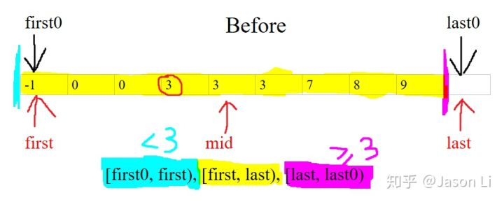
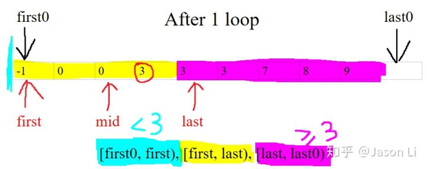
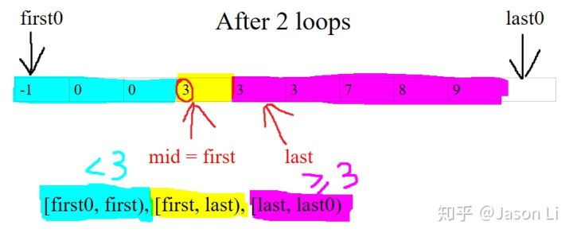
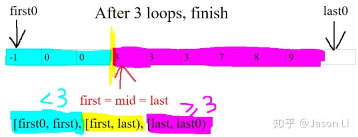

作者：[Jason Li](https://www.zhihu.com/people/jason-li-2-48)

链接：https://www.zhihu.com/question/36132386/answer/530313852

<!-- markdown-toc start - Don't edit this section. Run M-x markdown-toc-generate-toc again -->
**Table of Contents**

- [一、严格定义二分查找及其输入条件](#一严格定义二分查找及其输入条件)
- [二、Dijkstra 的干货 / 题外话](#二 dijkstra-的干货--题外话)
- [三、while loop 第一行：如何取中点](#三 while-loop-第一行：如何取中点)
- [四、while loop 的循环不变量 - loop invariants](#四 while-loop-的循环不变量---loop-invariants)
- [五、C++ 中的相关函数](#五 c-中的相关函数)
- [六、理解并使用 C++<algorithm> 的二分查找函数](#六理解并使用-calgorithm-的二分查找函数)

<!-- markdown-toc end -->


强烈安利 C++ 标准库 <algorithm> 里的超简洁、bug free 的通用写法

写成能跑的 Python 只有 6 行

即使区间为空、答案不存在、有重复元素、搜索开/闭的上/下界也同样适用：

```python
def lower_bound(array, first, last, value): # 返回[first, last)内第一个不小于 value 的值的位置
    while first < last: # 搜索区间[first, last)不为空
        mid = first + (last - first) // 2  # 防溢出
        if array[mid] < value: first = mid + 1
        else: last = mid
    return first  # last 也行，因为[first, last)为空的时候它们重合
```

$\pm 1$ 的位置调整只出现了一次！而且最后返回 first 或 last 都是对的，无需纠结！ 


诀窍是搜索区间 [first, last) **左闭右开！**

好处都有啥？请往下翻看看 "Dijkstra 的干货/题外话" ヽ (ﾟ▽ﾟ) ノ

（你一直在用的）两头闭区间 [l, r] 写出来的 binary search 一般免不了多写一两个 +1，-1，return，而且区间为空时 l 和 r 只有一个是正确答案，一着急就容易出错，除非你有肌肉记忆或者背下来了。


如果你想求的不是`第一个不小于 value 的值的位置`，`而是任意等于 value 的值的位置`，只需在更新区间之前先检查 `array[mid] == value` 是否成立即可。以下我们只讨论广义的求上界、下界的二分搜索，适用于完全相等的值不存在的情况。

担心搞错范围 / 终止条件 /edge case？

`array` 不是升序怎么办？

且听我徐徐道来ヽ (ﾟ▽ﾟ) ノ

-------------------------------

二分搜索写法可以分为求上下界两种，并转化为以下等价写法，可以解决各种细节问题：

（只讨论输入 `array` 是非降序 non-descending order 的情况。其他情况，如降序，可以通过自定义比较函数轻松转化为这种情况而无需修改原 `array`，毕竟 `array` 可能是只读 read-only）

i) 求**下界**，即找满足 `x >= value` 或 `x > value` 条件的**最小** `x` 的位置，

分别对应 C++ 标准库 <algorithm> 中官方钦点的

[lower_bound()](https://en.cppreference.com/w/cpp/algorithm/lower_bound) 和 [upper_bound()](https://en.cppreference.com/w/cpp/algorithm/upper_bound) (注 1)：

[注 1]：C++ 的 upper_bound() 虽然名字叫上界，但它的意义是 [equal_range()](https://en.cppreference.com/w/cpp/algorithm/equal_range) 的上界。它其实是 x > value 的下界，解释见文末。

用**左闭右开**搜索区间 `[first, last)`，

区间为空时终止并返回 `first` 或 `last`（重合，无需纠结），

求中点时从**下界** `first`（闭区间侧）出发：`mid = first + (last - first) / 2`，

以确保区间长度为 1 时，`mid = first` 仍在 `[first, first + 1)` 区间内； 

ii) 求**上界**（找满足 x < value 或 x <= value 条件的最大 x 的位置），可以调用互补的求下界的函数再减一得到，如 x >= value 的下界再减一就是 x < value 的上界，所以 C++ 标准库只提供求下界的两个函数。

如果非要写（不推荐），则是求下界的镜面情况，把所有数组下标反过来即可：

用左开右闭搜索区间 (first, last]，

区间为空时终止并返回 last 或 first(重合，无需纠结)，

求中点时从上界 last(仍为闭区间侧) 出发: mid = last - (last - first) / 2，

以确保区间长度为 1 时，mid = last 仍在 (last - 1, last] 区间内。

**中点 mid 有了，怎样缩小区间才能不出错？**

**请往下看到 『四、while loop 的循环不变量』 ヽ (ﾟ▽ﾟ) ノ有图有真相**


*（以下为详细解说，括号内的斜体为 C++ 相关的选读 (逃)）*

# 一、严格定义二分查找及其输入条件
上面给出的 Python 等价于 C++ 标准库 <algorithm> 里的 [lower_bound](https://zh.cppreference.com/w/cpp/algorithm/lower_bound) 函数。

*（C++ 的 upper_bound 和它只差了一个 if 括号条件，见文末）*

*（注意，C++ 还有个 [binary_search](https://en.cppreference.com/w/cpp/algorithm/binary_search) 函数，虽然叫二分搜索，但它只是调用 lower_bound 验证搜索值的存在性，返回 true/false）*

被各种 lower 下 upper 上搞晕了？看不懂链接里复杂的 C++ STL 源代码？

没关系，我们先看看 lower_bound 在干啥：

> 定义 lower_bound 函数：给定数组 array、区间 [first, last) 和一个目标值 value，返回区间内第一个不小于（即大于或等于）value 的元素的位置。若不存在，返回 last。
> 当然，二分搜索要求 array 已经排好序，默认是 non-descending order (非降序)，比如 [0, 1, 1, 2, 3]，若 value 为 1.5，那么第一个不小于 1.5 的元素为 2，下标为 3，所以返回 3。
> 
> *（严格来说，最弱的必要条件是 array 为 value 的一个 partition，但是排好序的 array 一定对任意 value 满足这个性质。）*
> *（如果输入是从大到小反向排序，甚至是按某种抽象逻辑顺序排序的，无需反转或改动原来的 array，只需修改 if 的比较逻辑即可。对于 C++ STL 中的函数，你可以传入自定义的比较函数来达到同样的效果，这也是 C++ STL 的强大之处之一。）*
> *（C++ 的 STL 中两个元素 x, y 的大小比较只使用 “小于” 函数，即 operator<()，可以自定义。如果 x, y 无法被 "小于" 函数区分，即 !(x < y) && !(y < x)，那么 x, y 就被认为是等价的。）*

换句话说，lower_bound 返回区间 [first, last) 内满足 x >= value 的最小值 x 的位置，即 value 在区间内的 lower_bound(下界)，因而得名。

若这样的 x 不存在，返回 last（而不是 -1）。如果你在做题，需要特殊返回值，那你可以特殊处理，但标准库的 lower_bound 奉行的是简洁而同一的逻辑：last 是原区间 [first, last) 外的第一个位置，是最自然的表示 “不存在” 意义的位置，代码中也无需特殊处理。

# 二、Dijkstra 的干货 / 题外话
为什么区间要写成左闭右开？怕傻傻分不清楚，一直用两头闭区间？

其实我们早就习惯了左闭右开区间，只不过你忘了它的便利。

例如：遍历长度为 n 的数组，下标 i 你是怎么写的？

你一定是使用左闭右开区间 [0, n) 作为起始和终止条件，这样一来循环执行次数为 n，for loop 结束时 i == n，一目了然，且无需多余的 $\pm 1$ 边界调整：

```python
for (size_t i = 0; i < n; ++i) {
    // i is in [0, n)
}
```

换成 Python 3，区间则是 range(start, stop[, step])，左闭 (包括起点 start) 右开 (不包括终点 stop)：

```python
for i in range(n):
    # 等价于 range(0, n)或 range(0, n, 1)
    # i is in [0, n)
```

同理的还有 [Python 的 slice](https://docs.python.org/3/library/functions.html#slice)，如 list slicing:arr[start:stop] 以及 arr[start:stop:step]。

一切始于图灵奖得主 [Dijkstra](https://en.wikipedia.org/wiki/Edsger_W._Dijkstra)（没错就是 20 分钟内不用纸笔发明 [Dijkstra's Algorithm](https://en.wikipedia.org/wiki/Dijkstra%27s_algorithm) 的那位神人）早在 1982 年的[安利](https://www.cs.utexas.edu/users/EWD/transcriptions/EWD08xx/EWD831.html) (他还安利过 [goto 有害论](https://en.wikipedia.org/wiki/Considered_harmful)，并且成功了)，大意是：

> 假设有一个长度为 4 的数组，用整数边界的区间表示它的下标 0, 1, 2, 3，有四种写法：
> a) 0 ≤ i < 4
> b) -1 < i ≤ 3
> c) 0 ≤ i ≤ 3
> d) -1 < i < 4
> 显然左边不闭的话 -1 太丑了，所以只考虑 a) 和 c)，然后怎么取舍呢？
> 现在假设该数组长度慢慢减小到 0，右边界减小，此时它的 index 范围是空集 \varnothing，整数边界的区间的四种写法变成了：
> a) 0 ≤ i < 0
> b) -1 < i ≤ -1
> c) 0 ≤ i ≤ -1
> d) -1 < i < 0
> 现在只有 a) 不会出现负数了。看来左闭右开的 a) 是唯一一种不反人类的写法！它还有一些个好处：
> 1. 区间两端值的差，如 [0, 4) 中的 4 - 0 = 4，正好是区间或数组的长度
> 2. 刚好相邻的区间，如 [0, 2) 和 [2, 4)， 中间值（即 2）相同，一眼就可以看出来

综上，代码中使用 a) 的左闭右开区间既符合直觉，又可以省去代码中大量的 +1 和 -1 和 edge case 检查，减少 [off-by-one error](https://en.wikipedia.org/wiki/Off-by-one_error)，提高效率。

# 三、while loop 第一行：如何取中点
现在我们知道 lower_bound 在干啥，以及为啥区间要写成左闭右开了。

我们来看循环第一行，`mid = first + (last - first) // 2`，为何中点这么取？

```python
def lower_bound(array, first, last, value):
    while first < last: # 搜索区间[first, last)不为空
        mid = first + (last - first) // 2  # 防溢出
        if array[mid] < value: first = mid + 1
        else: last = mid
    return first  # last 也行，因为此时重合
```

如 @胖君 等大佬们所言，

> 若用 mid = (first + last) / 2 算中点（下标的中位数），在 C++、Java 等语言里 (first + last) 可能会溢出。
> 讽刺的是，这是多年以前的标准写法，且[问题存在了 20 年都没被发现](https://ai.googleblog.com/2006/06/extra-extra-read-all-about-it-nearly.html)，比如 Java 标准库 java.util.Arrays 里的 binarySearch，因为当年的硬件限制了数组长度，所以测试的时候没有溢出。
> 解决方案就是我们的写法。评论区有人问为什么可以这么写，其实很简单：
> mid = (first + last) / 2
> = (2 * first + last - first) / 2
> = first + length / 2，
> 其中 length = last - first 为区间长度。
> Python 有 big integer 所以不怕溢出，但要记得 Python 3 的整除是 //。
> 
> 此外，中点的选择并不唯一：
> 1. 上位中位数：upperMid = first + length / 2（不用 -1，就它了）
> 2. 下位中位数：lowerMid = first + (length - 1) / 2

不难发现只有 length 为偶数时它们才不同，分别是中间那一对下标中的更大和更小的，想想 [0, 3) 和 [0, 4) 就很好懂了。

由于这两个中位数都在区间 [first, last) 内，所以都可以采用。算上位中位数不用 -1，就是你了！

**陷阱：**当我们使用左开右闭区间 (first, last] 找上界时，闭区间在右侧！本文开头已经说明，算中点时应从闭区间一侧向中心靠拢：

mid = last - (last - first) / 2

以确保区间长度为 1 时，mid = last 仍在 (last - 1, last] 区间内

如果不小心写成 mid = first + (last - first) / 2 那么此时 mid = first 就超出 (first, last] 范围了，要么溢出要么死循环！

所以推荐用互补的求下界的函数，再减一得到上界。

# 四、while loop 的循环不变量 - loop invariants
（怎样缩小区间才不出错）（会写代码 vs 会用计算机科学的思考方式）

要真正理解这 6 行代码为啥能出正确答案，并每次写 binary search 都能 bug free (而不是靠先写错再 debug，或者死记硬背上 / 下界开 / 闭区间的四种情况，甚至其他答案说的区间长度小于一定值时暴力分类讨论)，首先需要理解 while 循环里的 loop invariants (循环不变量)，也就是代码跑到 **while 里面时一定成立的条件（别怕，下面有图）：**

1. 搜索范围 [first, last) 不为空，即 first < last；
2. 搜索范围 [first, last) 左侧，即 [first0, first) 内所有元素 (若存在)，都小于 value，其中 first0 是 first 的初始值；
3. 搜索范围 [first, last) 右侧，即 [last, last0) 内所有元素 (若存在)，都大于等于 value，其中 last0 是 last 的初始值。

再看一遍代码：

```python
def lower_bound(array, first, last, value):
    while first < last: # 搜索区间[first, last)不为空
        mid = first + (last - first) // 2  # 防溢出
        if array[mid] < value: first = mid + 1
        else: last = mid
    return first  # last 也行，因为此时重合
```

(图来啦) 举个栗子，搜索整个 array = [-1, 0, 0, 3, 3, 3, 7, 8, 9]，value = 3



一开始黄色的搜索区间左右 (青、紫) 都是空的，loop invariants 的 2 和 3 自然满足。

上图 array[mid] >= 3，说明 mid 属于紫色！

在已知信息下，最大限度合理扩张紫色区间、缩小黄色搜索区间长度的操作是：

把 last 放到上图中 mid 的位置，即 last = mid：



如上图，新的 mid 满足 array[mid] < 3，说明 mid 属于青色！在已知信息下，最大限度合理扩张青色区间、缩小黄色搜索区间长度的操作是：first = mid + 1：



现在搜索区间长度缩短到 1 了！可以返回 first 了吗？不行，我们检查过了红圈左边和右边，却没有检查红圈本身。如果红圈是 2，那么答案应该是上图的 last 才对。

之所以更新 first 或 last 的时候要最大限度缩小搜索区间（first 更新为 mid + 1 而非弱一点的 mid，last 更新为 mid 而非弱一点的 mid + 1），主要考虑并不是这个效率 efficiency，而是上图区间长度为 1 的情况！此时 mid 就是 first，mid + 1 就是 last，于是弱一点的更新等于没有更新，会导致死循环！

最后一步，上图中 array[mid] >= 3，mid 属于紫色，于是 last 左移一位，搜索结束： 



最后区间 [first, last) 为空，青区间和紫区间都最大限度扩张了。所以，根据紫区间的定义任意元素 >= 3，已经饱和的它，第一个元素 (若存在) 的位置 last 就是答案！若没有满足要求 x >= 3 的元素，那么紫区间就是空的，停留在初始状态 [last0, last0)，所以返回的是 last0，即初始范围之后的第一个元素，表示 “不存在”，无需特殊处理！

皆大欢喜的是，first 与 last 重合，所以完全不需要纠结返回哪个！感谢 Dijkstra！

# 五、C++ 中的相关函数
C++ 的 lower_bound() 搞明白了，那么 upper_bound() 和 equal_range() 又是怎么回事呢？

upper_bound() 和 lower_bound() 一样是下界搜索，唯一不同的是第四行的 if 中的判断条件从：

lower_bound() 的 array[mid] < value，即小于，

变成了 upper_bound() 的 !(value < array[mid])，即 array[mid] <= value，（用小于号判断小于等于关系：前面提到小于号是 STL 唯一的比较函数，且可以自定义）

所以 upper_bound() 返回的是第一个大于 value 的位置。

如此一来，[first, last) 中与 value 等价的元素的范围就是：

[lower_bound(value), upper_bound(value))

它们分别是这个区间的 (左闭) 下界和 (右开) 上界，因此得名。equal_range(value) 的作用是同时返回这两个位置。 

# 六、理解并使用 C++<algorithm> 的二分查找函数

如何用 lower_bound() 和 upper_bound() 在 [first, last) 完成所有四种 binary search (上 / 下界，开 / 闭区间)？

1. lower_bound(value) 本身找的是 x >= value 的下界，若为 last 则不存在；
2. upper_bound(value) 本身找的是 x > value 的下界，若为 last 则不存在；   

   因为区间是离散的，所以：  

3. lower_bound(value) - 1 即为 x < value 的上界，若为 first - 1 则不存在；

4. upper_bound(value) - 1 即为 x <= value 的上界，若为 first - 1 则不存在。

相应代码可以参考 @LightGHLi 的高赞回答末尾。注意[实际在 C++ 中调用](https://en.cppreference.com/w/cpp/algorithm/lower_bound)时，表示位置的 first,last 以及返回值不是 Python 代码中的下标 int，而是 Container<T>::iterator 类型。
