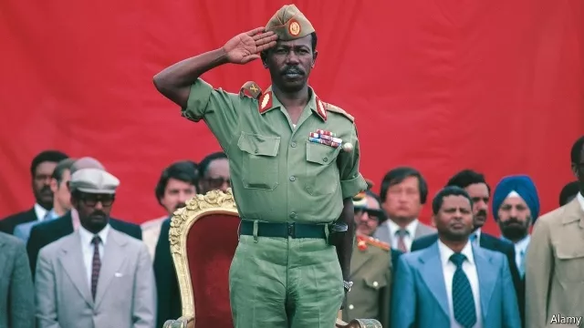

作者：沈方伟&凌力&冯翔

链接：https://mp.weixin.qq.com/s/AnBhVhWJNWlS8BpiPflhtw

# 地球上最伟大的一场演出


1984 年末的一天，美国两个混得最好的黑人在搞事情。

其中一个，是 51 岁的金牌音乐人昆西·琼斯。他是有史以来第一个在大音乐公司担任高管的美国黑人，一生获得过 77 项格莱美奖提名。

另外一个比他年轻 25 岁，但知名度比他高出不知多少倍。

**MJ——迈克尔•杰克逊。**

世界上最知名的音乐巨星，没有之一。

两年前的 1982 年，昆西·琼斯担任制作人，为杰克逊录制了一张专辑：《颤栗者》（Thriller）。

这是世界音乐史上销量最高的一张专辑，在全球卖出 1.5 亿张。对，就是他领着一大群僵尸跳舞的那支 MV。

这张专辑得了 8 项格莱美奖，打破世界纪录。杰克逊被哥伦比亚广播公司授予“全球最伟大表演者”称号。

这两个人，在研究怎么写一首歌。一首写给黑非洲的歌。

这一年，非洲国家埃塞俄比亚正陷于内战和饥荒，难民成批死亡。

欧洲的音乐人已经行动起来。

众多英国大牌歌星一起录制的义卖专辑《Do They Know It's Christmas？》（他们知道今天是圣诞节吗），发布后筹得 800 万英镑的善款。

几位美国音乐人也想录一首这样的歌，找到了昆西·琼斯。他立即建议：迈克尔·杰克逊是不二人选。

同时，还应该邀请另外一位黑人巨星：莱昂纳尔·里奇，奥斯卡与金球奖双料最佳电影歌曲奖得主。

接下来的一个礼拜，莱昂纳尔·里奇天天往迈克尔.杰克逊家跑，跟朝圣似的。

**他们想创作一首好唱又容易被人记住的歌。**

昆西·琼斯也没闲着。

他到处刷脸，找来了美国当红的 46 位歌手来录制这首歌，有比利·乔尔、布鲁斯·斯普林斯汀、鲍勃·迪伦、保罗·西蒙、肯尼·罗杰斯等，都是响当当的大牌巨星。

要不是超过一半的人都跟昆西·琼斯合作过，这 46 个大牌明星绝不可能愿意合作干一件事。

还剩半个月了，歌还没写出来。昆西·琼斯焦虑了，时不时给迈克尔·杰克逊家打电话，了解他和莱昂纳尔·里奇创作到了什么程度。

说话已经顾不得客气了，尽管电话线那头是亿万人追捧的世界第一歌星。

**我亲爱的弟兄们，我们 46 个人在不到三周后就要来了。我们需要一首该死的歌曲。**

我们现在都已经知道了这首歌——《四海一家》（We are the world）。


歌词是这样的：
```
当我们听到了恳切的呼唤
全世界应该团结一致
有些地方的人们正逐渐死亡
是该伸出援手的时候了
对生命而言这是最好的礼物
……
四海一家
我们都是孩子
我们创造光辉灿烂的明天
让我们开始给予
这是我们的选择
为此倾注我们的生命
靠你和我创造一个更美好的世界
……
```

[Song]We Are the World

迈克尔·杰克逊的二姐拉托亚·杰克逊目睹了弟弟的创作过程。她说：

**迈克尔写了 99% 的歌词，但是他觉得没必要说出来。**

1985 年 1 月 28 日，歌曲如期录制。46 位大牌巨星无一缺席。

《四海一家》专辑，为非洲筹到了一千万美元的善款。

当时，一个麦当劳巨无霸汉堡包在美国的售价，是 0.75 美元。


昆西·琼斯给明星们写了一封信：

```
……我们所有的组织者都感谢你们的付出。

在未来的岁月里，如果你们的孩子问，爸爸，当初你为反世界饥荒做过什么？你可以骄傲地说出你做过的贡献。
```

他们想不到，这首歌只是一个开端。重头戏还在后面。

接下来，这些全世界最大牌的明星会参与一场演出。

世界音乐史上最伟大、阵容最豪华，永远不可复制的一场演出。


## 01
1974 年，非洲，埃塞俄比亚阿法尔三角洲。

在经过两年的辛苦挖掘，法国地质学家莫里斯在一处谷地里发现了几块破碎的人体骸骨化石。

几个小时后，更多的化石被挖掘出来，最终凑成一具完整度 40% 的骸骨，编号 AL288-1。

因为正好在听披头士的《露西在缀满钻石的天空中》（Lucy in the Sky with Diamonds），莫里斯顺嘴把这具化石命名为“露西”。

这可能是埃塞俄比亚第一次和摇滚扯上关系。

之后的进一步检测认为：这是一名 20 岁，已经学会直立行走的女性猿人，距今已有超过 300 万年历史。

一时间，“露西”闻名世界，以“人类之母”之名，登上全球各大媒体头版。

坐落在非洲东北部的埃塞俄比亚，是一个充满神秘色彩的国家。


它有超过 4000 年的文明历史，人口近亿却饥荒不断。在 19 世纪末，一次就饿死了三分之一的人口。

它还有世界上最后一位掌权的皇帝，海尔·塞拉西二世，以及非洲最大规模的 100 万陆军。

“人类之母” 的新闻刚刚发布几个月，这个国家又一次登上世界各大报纸的头版：海尔·塞拉西二世被军队推翻。

从此，埃塞俄比亚不再有新闻。

十年后的 1984 年，埃塞俄比亚的掌权者，一位叫门格斯图的上校邀请各国媒体前往首都亚的斯亚贝巴，参加军政府上台十年的庆典。



这一年，受持续高温和撒哈拉沙漠南扩影响，非洲遭遇了一个世纪以来的最大旱灾，34 个国家近 1.8 亿人陷入饥荒。连万里之外的中国红十字会都发出了为非洲捐款的号召。

埃塞俄比亚是受灾最严重的国家之一，但这场庆典却异常宏大。门格斯图花费 1 亿美元，把亚的斯亚贝巴装饰一新，采购各类美酒佳肴，大宴宾客。做派俨然他当年推翻的皇帝。

庆典结束一个月后，几个欧洲记者才获得许可，前往埃塞俄比亚饥荒严重的北部省份拍摄一部纪录片，题目是军政府审过的：

**创纪录收成的欧洲社会，为何不用盈余帮助埃塞俄比亚的饥饿难民？**

结果，BBC 记者迈克尔·比尔克搞了个大新闻，把大饥荒最真实的一面呈现给了世界。

看到这条新闻的人当中，有一个三流的屌丝歌手：

**鲍勃·吉尔道夫（Bob Geldof）。**


34 岁的吉尔道夫出生在爱尔兰，当过兵，杀过猪，做过罐头厂工人，最后干了摇滚乐。

他组建过一个乐队，叫“布姆镇鼠”乐队，最好的成绩是一次冲进过英国排行榜前 50。

看到埃塞俄比亚的饥荒，吉尔道夫坐不住了。但多年来死磕摇滚乐，让他已经负债累累，拿不出多少钱。

之后，他找到一众英国歌手，于是便有了那张专辑《他们知道今天是圣诞节吗》。

1985 年 1 月，当吉尔道夫第一次来到埃塞俄比亚，他被地狱般的景象震惊了。

**脂肪，肌肉，都被饥荒的大口从内部吞噬掉了，灵魂已经从他们的身体里消失了，只剩下空洞，空白的眼神。**

**志愿者们每天在上万人中里选出快要饿死的几百个人，分发为数不多的食物。**

**但，这些人已经不愿意再吃饭了。因为咀嚼需要力气，胃也没办法消化食物。**

**每天都有数百人死去，尸体就堆积在营地里无人处理。**


回到英国后，吉尔道夫决定，办一场全是大牌明星的慈善义演，继续为埃塞俄比亚募款。这场演出将在英国和美国同步举行。

由于有了上次录制专辑的名声，他找到了：

**大卫·鲍伊、鲍勃·迪伦、保罗.麦卡特尼、U2、谁人、滚石、黑色安息日、海滩男孩、皇后、威猛、菲尔·柯林斯、艾尔顿·约翰、尼尔·杨、恐怖海峡、齐柏林飞船、斯汀、麦当娜……**

他们每一个人、每一支乐队的名气和影响力，都足够举办一场爆满的大型演唱会。

而现在，他们同意全部同台，无偿表演，收入全部捐给埃塞俄比亚。

这个人类起源的国家。

## 02
演唱会最初定在 1985 年 7 月 6 日，正好是美国独立日假期的最后一天。但因为一些歌手有约在身，只能又延迟一周，定在 7 月 13 日举行。

最初，英国场演唱会的地址选在伯明翰的亚历山大体育场，但亚历山大体育场离伦敦太远，容量也太小，于是只剩下了温布利体育场。

没想到，这个时间和场地上的无奈选择，为他们节省了一大笔钱。

斯汀——“警察”乐队单飞后的主唱，正好 7 月 12 号在温布利体育场有演唱会。往后一天，刚好能省下布置场地的花销。

温布利体育场的租用价格是 10 万英镑。所以，伦敦场的演出门票定价 25 英镑，其中 5 英镑是场地等费用，20 英镑是给非洲的捐款。

不愧是搞摇滚的，吉尔道夫是一个性格非常有棱角的刺头儿。在埃塞俄比亚之行期间，他曾跟记者干了一架。这一次，他公报私仇，给媒体坐地起价：

**记者的坐票比普通观众贵一倍，50 英镑；如果想四处走动，就要另付 100 英镑，购买特别通行证。**

美国场地，一开始选择了加州、纽约、华盛顿。但它们很快都被否定了。

加州时差对不上，无法跟英国同步开场；华盛顿维稳大局为重，政府不批；纽约麦迪逊中央花园场地谈不拢。

这个时候，费城市政府主动联系了吉尔道夫：

**我们愿意提供 10 万人的肯尼迪体育场，所有设施与安保服务全部免费。**

原来，不久前的 5 月 13 日，费城警察在拆除黑人激进组织"MOVE"占据的违建房屋时，使用了爆炸物，引发的大火造成 11 人死亡。

当消防队赶到时，市长却说了一句：**让火烧吧。**

让火烧吧，这句话成为费城政府的最大丑闻，一时间市长官员纷纷下台。幸亏说这句话的市长也是黑人，不然肯定闹出种族暴乱。

后来，这句话到底成了一部纪录片的名字。

这一次，费城免费提供演出场地，说起来就是为了挽救政府形象的一场公关活动。

这座诞生过《独立宣言》的城市，以一个魔幻的理由再次载入了历史。

筹备时，百事可乐宣布花费 100 万美元购买了两场演唱会的独家赞助权。因此，在电影《波西米亚狂想曲》里可以看到：皇后乐队上场时，弗雷迪弹的钢琴上摆满了百事可乐的纸杯。

为了避免产生矛盾，吉尔道夫给每个明星都定了规矩，每个人只能演唱 15-20 分钟，唱自己最新或者最热门的歌。即使这样，整场演出总时长也达到了 16 小时。

消息传出，整个世界疯掉了。

BBC 和 ABC 分别各花 100 万美元购买了版权。全球 14 颗卫星、上万个地面接收站、100 多个国家的电视台将同步转播这场音乐会，届时将有超过 15 亿人观看。

一位马来西亚的石油大亨声明赞助演唱会期间的各种花费，英国皇室宣布派出成员参加当天的伦敦场演唱会。

NASA（美国国家航天局）甚至说，将在 7 月 13 日发射的 “发现者号” 航天飞机上向宇航员们直播这场演出。

东京、悉尼、科隆甚至莫斯科的摇滚乐队纷纷宣布，自愿加入这场演出。当天，他们将在各地同时举办一场义演。

在英国，所有的演出公司和工作人员都在为演出积极筹备时，美国演出工会通知吉尔道夫：

**所有的工人工资、设备费用必须先期照付，不然你就休想看到演出。**

他很纳闷：

**为什么英国人都在为这场演出无偿工作，而美国人则到处都在要钱？**

他给这场演出起名：Live aid——“拯救生命”。

演出的 LOGO，是非洲地图和一把吉他的组合。

## 03
**现在是伦敦中午时间 12 点，费城时间早上 7 点，全球瞩目的“拯救生命”演唱会马上就要开始了。**

**皇室成员也光临了温布利，让我们欢迎……**

万众（确切的数目是七万两千人）欢呼中，戴安娜王妃和查尔斯王子一先一后走上看台。鲍勃·吉尔道夫跟在他们身后。两个小时后，费城的演出将在地球另一端开始。


**“拯救生命” 开始了。**

第一个上场的，是英国传奇摇滚乐队“现状”（Status Quo）。

梳着马尾辫的弗朗西斯·罗西台风极佳，唱之前只说了三句话，很照顾观众迫切的心情：

**Hello！How are you right？You right？**

第一首歌，是《让世界摇滚起来》（Rock in' All Over The World），曲调欢快、活泼有劲：

```
oh，我们驻足此处，从此开始
全员都齐，摇滚之路
从此开始
让世界摇滚起来！
……
```


[Song]Rockin' All Over The World

现状乐队是一支成立二十年的传奇老炮儿，当时正在闹分手危机。是这次“拯救生命”让他们重新聚到了一起。

第二个出场的是“风采委员会”乐队，他们最热门的歌是《国际主义者》。这首歌的名字非常应景，它当然出现在了“拯救生命”上。

第三个就是吉尔道夫和他的“布姆镇鼠”。这是他第一次在如此规模的舞台上演出。在参加这次 live aid 演出的所有明星中，恐怕他的名气是最小的。

然而，从这一刻起，不一样了。

超声波乐队的新浪潮朋克、史班道芭蕾乐队的新浪漫风格、尼克·克肖的流行电音、尼日利亚裔女歌手萨德的温暖灵歌……

一个个风格迥异的大牌明星、乐队相继登台，这是世界音乐史上难得一见的奇观。

更不要说还有大牌的联袂演出了。第十个上场的，是斯汀和菲尔·柯林斯。两人一个挎吉他，一个弹钢琴，时而独唱，时而相合。

尽管前一天，斯汀刚在这里举行了自己的个人演唱会，他还是没唱够。

于是，不久他又出场了，跑去给人唱和声——搭档是一支大名鼎鼎的乐队：

**Dire Straits——恐怖海峡。**


很快，他高亢清亮的歌声，飘扬在温布利体育场上空。“I want my MTV……”

没错，恐怖海峡的代表作，《不劳而获》（Money for nothing）。

[Song] Money For Nothing

这些人，都是八十年代世界摇滚的刀锋。他们对后发国家的启迪作用，是不可估量的。尤其是中国。

拿这首《不劳而获》的两个演唱者来说，就各自影响了中国摇滚的一部分。

刚出道时，崔健经常被人说风格像斯汀。他自己也说过：

**我的《一无所有》《假行僧》是受斯汀的影响，《新长征路上的摇滚》是受警察乐队的影响。**

恐怖海峡，则深刻影响了苏阳。

年轻时，苏阳得到了一盘翻录的磁带，喜欢得要命，翻来覆去听了无数遍。

磁带上没写名字他又不懂英语，都听烂了也不知道叫啥。很多年以后，他才知道那叫恐怖海峡。

八十年代，对中国而言是刚刚睁眼，世界却是风华正茂。


## 04
风华正茂这个词，如果非要用来形容当天的某一支乐队，那一定是他们——皇后乐队。

《波西米亚狂想曲》的前奏一响，全场欢声雷动。纽约时报当天的报道称之为：皇后最精彩的一次现场。

之前，吉尔道夫打电话邀请皇后乐队主唱弗雷迪，一直联系不上弗雷迪本人。经纪人悄悄告诉他：

**弗雷迪很好面子的，你现在可以对外公布，到时候他不好意思不参加。**

所以，电影《波西米亚狂想曲》里，那个同性恋经纪人扣押消息，一直不告诉弗雷迪的情节，并不是真的。他也不知道自己有艾滋病。那是两年后的事。

此时的弗雷迪状态极好，还专门为了这次演出做了精心编排。这首歌有六段，他只唱了最有现场氛围的第二段。随后巧妙地接到第二首，《Radio Gaga》……


[Song] Bohemian Rhapsody / Radio Gaga

一年以后，一个小女孩出生在纽约，名叫史蒂芬妮·乔安妮·安吉丽娜·杰尔马诺塔。她最喜欢的歌，就是这首《Radio Gaga》。

20 岁那年，她干脆给自己取了个艺名：**Lady Gaga。**

现场气氛 HIGH 到了极点。不断有人兴奋得昏倒，被从温布利体育场抬出来。

也可能是热的。

当天的气温本来就高达 32 度。七万名男男女女挤在一起嘶喊、跳动，温布利声浪阵阵，热浪滚滚。无数人脱掉了衣服，男人赤裸上身，女人只剩胸罩。

工作人员不得不请附近的消防队赶来支援，使用高压水枪向现场的人海中喷水降温。


温布利的卫生间根本招架不住这么多人，很快就堵了、坏了。女人们一度强行占领了男卫生间，排队四五小时才能上一次厕所。很多人只能用啤酒瓶或者塑料瓶子解决问题。

伦敦场开始两小时后，费城场准时开始。

这又是世界上最奇特的一场演出——隔着半个地球，两边的观众却能同时观看。

温布利体育场和肯尼迪体育场的电视大屏幕上，互相转播对方的现场实况。每一支乐队上场前要有 20 分钟左右的设备调试时间，正好可以用来转播另一头的演出。

来自全世界的捐款电话洪水一般汹涌而来。接线员一个个忙得手脚不分。

那个年代没有互联网众筹。吉尔道夫最初委托 BBC 开设了 20 部电话负责接听电话捐款，后来又委托一家电话交换机公司的 200 人团队。

人们只需要拨打电话，报上自己的信用卡号和捐助金额，表明自己愿意给非洲捐多少钱，就可以完成捐款。

网易云音乐上，对 Live aid 有一句评论，大意是：

**每个看这场演出现场录像的人，都发觉自己晚生了几十年。**

## 05
早在演出的筹备阶段，吉尔道夫就焦虑得要死，好几天晚上睡不着觉。

这么多大牌，普遍都是桀骜不驯屌炸天的人。

只要他们中有一两个人喝大了放鸽子，到时候麻烦就大了，演出顺序什么的都得重排。因为，他自己就是个一向不靠谱的刺儿头。

何况，这场演出也没有签什么合同，大牌们大多只是一句简单的“行”。

结果，他们都来了。乱子恰恰出在他的老乡，爱尔兰乐队 U2 身上。

这支世界级的摇滚乐队，有一个同样世界级爱搞事情的主唱——波诺。

本来给 U2 安排的是连唱三首歌。结果刚唱了一首，波诺就从台上蹦下来，越过安保线把观众席里的一个姑娘拉到台上，一起跳了一段慢悠悠的舞。

U2 乐队的其他成员全傻了，不知道该怎么表演了。现场一片大乱。

吉尔道夫大怒，大骂老乡你真他妈不地道。二十年后，这场演唱会出官方纪念版 VCD 的时候，U2 的演出部分就给全裁掉了。

事后，姑娘为波诺辩护说，当时人太多，几乎把她踩死，是波诺救了她。

但波诺却一点不给面子，说了实话：

**作为一个表演者，我不满足于表演者同观众之间隔开的那段距离。我总是试图跨过那段距离。**

**这对我们乐队来说是场大演出，有 10 亿人在看，而我们没有唱我们出名的歌。每个人都对我很恼怒，甚至是非常恼怒。**

**那个举动毁了我的一天，我以为我会把乐队的前程都毁了。**

被裁掉的不止 U2。

齐柏林飞艇乐队因为鼓手酒后意外去世，已经解散 5 年了，因为这次 live aid 才临时重聚。他们连鼓手都没有，现请菲尔·柯林斯客串了一把鼓手。

因为实在是太久没有重聚了，这支伟大的乐队，演成了一次大型车祸现场。

菲尔·柯林斯打错了节奏不说，主唱唱歌走调，嗓子还劈了。二十年后，他们主动要求把他们的演出部分剪掉。

同样因为这场演出被寄予厚望的，当然还有世界上名气最大的摇滚乐队。

**BEATLES——披头士。**

从 1970 年起，他们就解散了。保罗·麦卡特尼已八年没有演出，列侬更于 1980 年在美国被人枪杀。

《太阳报》头版头条刊登报道说，为了这次演出，披头士剩下的三个成员将重聚。吊足了全世界的胃口。

天色全黑，英国场的演出进入尾声了。

钢琴声响起。万众欢呼如潮水袭来。

披头士并没有现身。只有麦卡特尼，一个人孤独地坐在台前，弹着那架钢琴。

这是他八年来，第一次登台演出。

他开口，是那首全世界摇滚乐迷都熟悉的歌：

**Let it be。**


[Song] Let It Be

从 1970 年披头士宣布解散起，他们再也没有合作过。包括这一次。

**陌路太久，劫波难度。**

人世间的欢笑与欲望，鲜花与眼泪，麦卡特尼已经见得太多太多。

43 岁的他面容无比平静，尽管眼角已爬满皱纹。

唱这首完全由他自己作词作曲的 let it be，不仅应景，而且没有版权上的麻烦。

## 06
美国那边的热度，丝毫不次于英国这边。

星光璀璨的费城场，演出的歌星和乐队达 30 组以上，从上午九点一直唱到晚上十一点，持续了 14 个小时。

尽管迈克尔·杰克逊本人因录制专辑《BAD》未能出场，但美国发达的音乐工业，随便拿出两个名字，就能颠倒众生。

今天，有吉尼斯世界纪录认证过的，二十世纪最红的女歌星——麦当娜，娜姐。此刻 27 岁的她，正是青春无限的年纪。


今天，有一生获得 19 次格莱美奖，唯一一位三度入主摇滚名人堂的摇滚传奇人物埃里克·克莱普顿。


还有滚石乐队的主唱，米克·贾格尔。他们的标志——那条红色的大舌头，是世界上最著名的摇滚 LOGO。

郑钧给自己的儿子取了个英文名贾格尔，就是为了向这位一生放荡不羁，73 岁还生了第八个孩子的传奇老炮儿致敬。

几十年后，一个中国香港走出来的女电影明星改玩摇滚，还跟北京的一家唱片公司签了约。

**她的微信头像，就是滚石乐队的那条大舌头。**

不搞点事情，那就不是米克·贾格尔了。

他跟摇滚教母蒂娜·特纳对唱时，猛一下扯掉了她下身的裙子，硬是让她只穿着黑色丝袜和内裤唱完了整首歌。


唱完歌，蒂娜·特纳赶忙下台换装。Live aid 结束后，她就出版了自己的自传。大概是觉得参加了这场演出，自己可以盖棺论定了。

今天，这里还有一个诡异的演唱者：几个小时前刚刚在伦敦唱完歌的菲尔·柯林斯。

隔着半个地球，他是怎么飞过来的？


还真是飞过来的。

在伦敦退场后，菲尔·柯林斯立即搭乘一架停在温布利体育场附近的直升机，直飞伦敦希斯罗国际机场。在那里，一架注册号 g-boag 的英国航空协和式飞机正在等他。

协和式飞机，是世界航空史上一个惊鸿一瞥的名字。它的速度比波音 747 快一倍以上，从伦敦到纽约只需要约三个小时。

这架飞机追着太阳飞，其速度超过地球围绕太阳转动时的自转速度。也就是说，乘客们抵达时，当地时间竟然比他们出发时还早。

这次，菲尔·柯林斯利用了这架飞机的超级速度。协和号飞机在温布利体育场上空盘旋一圈后，冲上云霄，向 5600 公里外的纽约赶去。

落地后，他有 32 分钟时间继续乘坐直升机，前往费城的肯尼迪体育场。

由此，他成为世界上唯一一个在 live aid 两地现场都参加了演出的人。

几天后，有媒体质问：

**为什么菲尔要从伦敦飞来纽约？除了耍酷和浪费以外没有什么价值。**

**已经有这么多大牌了，不差他一个。如果有那些钱，为什么不把它们直接捐给非洲难民？**

其实这倒冤枉了菲尔·柯林斯。他的这场旅行总花费 5 万美元，是由英国航空赞助的。

不过，他还惹出了别的乱子。在温布利体育场附近，一个家庭正在举行婚礼。接他的直升机降落时，旋翼扇动的气流把布置好的婚礼现场全给吹飞了。人家不干了。

吉尔道夫不得不赶过去擦屁股，道歉时发现新郎新娘居然都是大卫·鲍伊的粉丝。就把大卫·鲍伊叫过去给新人唱了一首歌，成功化解矛盾。

**这可能是世界婚礼史上最奇特的一次即兴演出。**

最后压轴的歌手，是全世界民谣乐迷奉若神明的，未来的诺贝尔文学奖得主。

**鲍勃·迪伦。**

不负众望，他以挎着吉他、架着口琴的经典形象出场，第一首，唱的也正是那首《答案在风中飘》（Blow in the wind）。

最后，莱昂纳尔·里奇领头，招呼当天参加演出的费城场全部歌星，以及当天担任伴唱的所有小演员一起上台，齐唱了《四海一家》。

所有的大牌歌星都成了伴唱。现场十万名观众的伴唱。

场上、场下，到处是挥动的双手，和热泪盈眶的面容。点亮的打火机汇成一片星星的海洋。

这一刻，音乐没有国籍、性别、风格、流派之分，回归了它的本质。

[video]

## 07
Live aid 结束了，捐款活动并没有结束。专门账户上的数字一天天不断攀升。

伦敦一对新婚夫妇决定卖掉他们的房子，把钱捐给非洲。

很多爱尔兰老妇人来到邮局，要求捐出自己唯一的财产——结婚戒指。因为戴在手上太多年，那些戒指已经取不下来了。她们只能先去买块肥皂，把手在肥皂水里泡一会儿。

在伦敦场的演出中，爱尔兰人在当天占据了捐款的最大份额。这不仅是因为吉尔道夫和 U2 都来自爱尔兰。

19 世纪中期，爱尔兰闹了饥荒，四分之一的人口不是饿死就是逃亡美国。今天，爱尔兰的人口也只有英国的二十分之一。

**捎带说一句：闹饥荒的时候，爱尔兰在英国统治下。**

甚至吉尔道夫走到大街上，都会有人不断把钱塞给他，从几便士到几百英镑。他告诉他们，把钱存到邮局的账户上，但人们都说：鲍勃，交给你我们最放心。

当然，人性在哪儿都一样。

有人一口气捐出了自己的全部家当 3000 英镑，却又在半个月之后反悔，写信给吉尔道夫：

**你们能不能退给我一部分？我当时是一时冲动，实在没能力捐这么多。**

时任美国总统的里根签署法案，宣布将 7 月 13 日定为美国国家纪念日，同时将考虑修改非洲援助计划。

英国女王伊丽莎白二世授予吉尔道夫爵士称号。挪威、英国和爱尔兰议会联合提名他为 1985 年诺贝尔和平奖候选人。

毛里求斯国家航空公司打来电话，他们提供两张头等舱往返机票和两周的五星级酒店，只需要拍一张照片用于宣传：吉尔道夫在毛里求斯度假。

吉尔道夫动心了。因为这些年搞摇滚，他真的很穷，从来没住过那么好的酒店，更别说旅游了。

但他又担心，刚被他在 live aid 宰了一刀的媒体报仇，报出个大新闻，只好忍着肉痛拒绝了。

这个新闻的标题，他自己都能想出来：

**吉尔道夫正在海滩上晒太阳，而他身后的非洲有上千万人正在忍饥挨饿！**

美国是募款最多的国家，募集了总捐款的 50%。所以，最终善款的 10%用于救济无家可归的美国人。

但单笔最大的捐款，却并不来自美国，而是来自遥远的中东——阿联酋总统谢赫·扎耶德·本·苏丹·阿勒纳哈扬。

这位已经 67 岁，统治了阿联酋 32 年的大酋长看了 live aid 的现场直播，激动得不能自己，宣布自掏腰包，捐赠 100 万英镑。

为了免除 live aid 募捐专辑销售的增值税，吉尔道夫找到了英国首相撒切尔夫人。

撒切尔夫人最初不同意免税，国内舆论大哗。这位铁娘子不得不做出让步，取消了增值税，通过电视向全国民众道歉。

毕竟，这么大的英国，捐款还不如爱尔兰多。从这一点看，大英也迟早要完。

live  aid 最终为非洲国家筹集了 1.27 亿美元。

吊诡的是，倾全世界之力捐助的这么一大笔钱，并没有拯救埃塞俄比亚的饥荒。

## 08
从第一批食物抵达埃塞俄比亚开始，吉尔道夫的人就发现：没有办法把它们运到灾区。

铁路残破、道路不通，也没有汽车。如果你自己跨海运来汽车，马上就会被打内战打红了眼的军政府没收。

1985 年，一大批食物就这样腐烂在红海旁边的码头上。

彻底绝望之后，吉尔道夫和他的团队决定，在埃塞俄比亚邻国苏丹购买一个二手卡车车队，进行维修后，从陆路进入埃塞俄比亚，强行把食物运到灾区。

在买到这 80 辆卡车，把它们维修到可以运行之前，就白白耽误了五个月时间。

一直到这个从苏丹北部出发，强行越过双方交火线，将食物送到北部灾区的车队被门格斯图上校发现后，情况才得到了稍许改观。

那时，门格斯图正在战争中腹背受敌。北部提格雷省的反对力量“提格雷人民解放阵线”，与东北部厄立特里亚地区的武装，正在对他合力夹攻。

Live aid 捐助的食物和钱，正好成了他的强心针。

门格斯图同意：车队可以在他的军队打到某一个地区后，跟着进入，发放食物。

这实际上是他收买人心的一项计划，让灾民们认为这些食物来自他。只要他们站在他的一边，就有饭吃。

全世界的善良愿望，成了内战的一个筹码。

无国界医生组织曾恳求吉尔道夫不要发放赈灾款，直到有一个可靠的机构能够把钱送给灾民，否则只会加剧内战和死亡。他却我行我素，说出一句著名的话：

**我们左手会跟魔鬼握手，右手会给灾民捐款。**

第一个向世界报道埃塞俄比亚饥荒的的 BBC 记者迈克尔·比尔克说：

**埃塞俄比亚大饥荒改变了所有的事情，又什么都没有改变。**

**它从根本上改变了富人世界对饥饿和穷人的责任感知力，但却什么都没有解决。**

埃塞俄比亚的内战，到 1991 年才最终结束。门格斯图上校被推翻。

百度一下门格斯图上校的名字，会发现他的生卒年份是 “1937-2008” 。实际上，他到今天都好端端地活着。

按照埃塞俄比亚的新宪法，门格斯图于 2008 年被判处死刑。但这场缺席的刑罚注定无法执行。早在 1991 年，他就逃到了津巴布韦，成功获得穆加贝的政治庇护。

1937 年出生的他，今年已经 82 岁，一直生活在津巴布韦。他还曾经获得过一个人权奖的提名。这个奖叫：

**卡扎菲国际人权奖。**

同一年，皇后乐队主唱弗雷迪去世，时年 45 岁。这两个素未谋面的男人，在那一年都迎来了自己命运的转折点，结局却如此令人慨叹。

2000 年，温布利体育场关闭拆除。2003 年，由于成本太高等原因，最后一架协和式飞机退役了。

想像菲尔·柯林斯那样赶场子，在一天内跨越半个地球参加两场演出，再也没有可能了。

**仿佛是一个流星般华丽时代的谢幕。**

这些年来，吉尔道夫一直在做公益。2005 年，他又发起了一场群星汇聚的演唱会，取名“live 8”，借以向正在举行的 8 国集团峰会施加影响力，要求这些发达国家减免非洲国家的债务。

20 年前曾经参加 live aid 演唱会的麦卡特尼、麦当娜和 U2 主唱波诺等人，又成了这场 live8 演唱会上最耀眼的明星。

后来，8 国集团宣布减免 18 个非洲最贫穷国家的长期债务。时任美国总统的小布什宣布，将美国对非洲国家的无偿援助增加一倍。

不过，吉尔道夫一直拒绝就当年 live aid 的捐款是否有效使用的问题接受采访。

2009 年，迈克尔·杰克逊意外去世。随着 Facebook 和 Iphone 的普及，这一消息震惊了全世界。

同这位世界第一歌星一起逝去的，还有音乐。

互联网拉平了地球，却杀死了音乐。世界再也不可能产生披头士、鲍勃·迪伦、迈克尔·杰克逊这样的音乐人了。

当年的 Live aid，彻底成了绝唱。


## 09
2019 年 3 月 22 日，以皇后乐队主唱弗雷迪生平为题材的《波西米亚狂想曲》在中国内地上映。

其中，全片的高潮，就是结尾，皇后乐队在 Live aid 的精彩演出。


当年参与演出的皇后乐队两名成员，吉他手布莱恩·梅和鼓手罗杰，已是白发苍苍。

他们俩亲自在微博上发布了一段视频，呼吁中国观众去看这部电影。

这时候，很多人才知道，曾经有过一场那么伟大的演出。世界上最大牌的明星们聚在一起，只为了援助一个遥远的国家，埃塞俄比亚。

今天，对埃塞俄比亚援助力度最大的国家，是中国。

这些年，中国帮埃塞俄比亚修建了铁路、公路、发电站，和第一个国家工业园区。埃塞俄比亚最近的一位总统，也是在北京大学接受的教育，从本科一直读到博士。

多少弥补了中国当年错过那场演出的遗憾。

Live aid 结束一天后的 1985 年 7 月 15 日，《人民日报》刊登了一条消息：《百多位著名歌星为非洲灾民进行募捐》。

**……13 日中午，音乐会首先在伦敦威姆布莱体育场开幕，72000 多名听众出席了音乐会。两小时后，有九万人参加的在费城约翰·肯尼迪体育场举行的音乐会也宣布开始……**

全文一共 239 个字。这就是中国跟这场演出的全部关系。

**对中国来说，它来得太早了。**

跟埃塞俄比亚一样，中国并不在转播这场演出的国家名单当中。

中国还没有摇滚乐。《一无所有》还要有大半年才诞生。只有一位名叫张蔷的女歌手，出版了中国的第一张迪斯科专辑。

中国这一年有更重要的事情：人民解放军裁撤百万，全力投入经济建设；全国统一建立乡政府，女足第一次被定为全国性比赛的体育项目，男足的比赛则引发了中国历史上第一次球迷骚乱……

至今未找到中国人在现场观看 Live aid 的记录。能在那个年代看到它的录像，都算是凤毛麟角的幸运者。

高晓松就是一个这样的幸运者。

他父亲从美国给他邮来一盘 Live aid 的现场录像带，他看了太多遍，一直把图像看成了雪花状。还拉着老狼一起看，两个人看得眼泪长流。

日后，他在自己的视频节目《晓说》里，如此评价这场演出：

```
我觉得我们是最幸福的一代人，我们正好成长在八十年代。

我们十几岁到二十出头，正在形成自己世界观的时候，海面上全是灯塔，把海面全部照亮。

为什么人家管我们这一代人叫最有理想的一代人，不是因为我们天生基因里有理想，而是因为我们成长在一堆充满理想主义的大师光芒照耀下。

即使有一天灯塔都熄灭了，海面上一片漆黑，我们也基本知道方向要往哪里去。
```